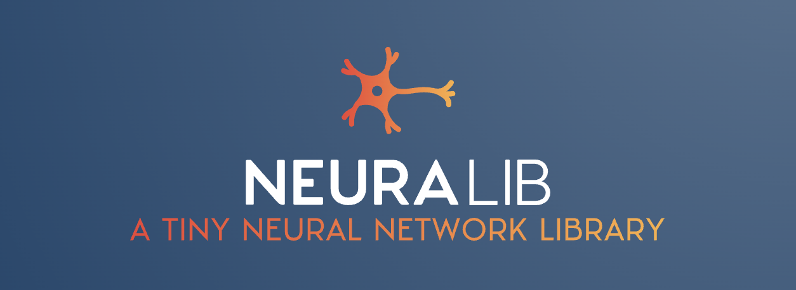

# Neuralib: a tiny library developed to demistify neural networks

This small python module has been developed purely for learning purposes. It's an implementation of simple neural networks using numpy as only dependency.

> *"…everything became much clearer when I started writing code."* - Andrej Karpathy

## Using neuralib
To update your conda environment so that neuralib dependencies are met, run:
`conda env update --file environment.yml --prune
`

To create a conda env from the environment.yml file, run:
`conda env create --file environment.yml --name neuralib_env`
### ...to learn about Neural Networks
Head over to the `examples/` folder and run one of the simple scripts. This should be your starting point to reverse engineer the inner workings of Neural Networks.
### ...as a Neural Network module
From the root of the repository, run `pip install .`
Now you should be able to open a Python console in your terminal and do `import neuralib`, which will also work in your scripts.

**If you find a bug or missing feature that you know how to implement, open a Pull Request and I'll be happy to get it merged! ❤️**

## Resources
The following resources have been very helpful in the development of this library:
- Machine Perception Course (ETH Zurich) Notebooks: https://ait.ethz.ch/teaching/courses/2022-SS-Machine-Perception/
- CS231n Course (Stanford) Notes: https://cs231n.github.io/
- Andrej Karpathy's blog: http://karpathy.github.io/neuralnets/ 